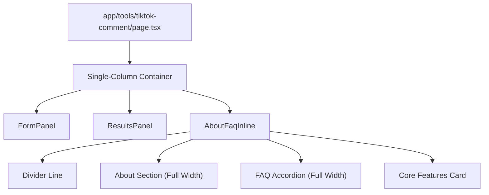

# Design Specification: TikTok About & FAQ Inline Integration (Single Column)

## Overview
This document specifies the integration of the TikTok Comment Generator's About and FAQ contents directly onto the main tool page, the deletion of defunct standalone about/faq routes, and the styling of reference content in a clean, single-column vertical stack at the bottom of the page.

## Requirements
1. **URL Deletion:** Remove standalone About and FAQ pages. Update registry links and sitemap.
2. **Layout Integration:** Render the About and FAQ sections directly below the Results panel in a vertical single-column stack on `/tools/tiktok-comment`.
3. **Accordion FAQ:** Provide a collapsible accordion UI for FAQ answers with smooth transitions.
4. **Cohesive Design:** Maintain the default light mode warm-cream and dark ink color palette, using thin borders and default button styling.

## Proposed Architecture & Component Flow

### 1. Main Page Layout
* In `components/comment-assistant/index.tsx`, the layout remains a single vertical column (`flex flex-col gap-10`), with `AboutFaqInline` appended at the end of the stack.

### 2. Inline About & FAQ Component
* Create `components/comment-assistant/about-faq-inline.tsx`.
* It fetches the About and FAQ data for `"tiktok-comment"` from `@/lib/content/generator-info`.
* It renders a full-width divider: `
`.
* It renders the About content, followed by the FAQ collapsible accordion using `framer-motion` height transitions, followed by a features grid inside a clean card.

### 3. Cleanup Checklist
* Delete `app/tools/tiktok-comment/about/page.tsx`
* Delete `app/tools/tiktok-comment/faq/page.tsx`
* Update `lib/content/generator-info.ts` (remove `/tools/tiktok-comment/about` and `/tools/tiktok-comment/faq` links).
* Update `public/sitemap.xml` (remove the deleted pages).

## Verification Plan
1. **Layout Verification:** Verify the About and FAQ contents appear at the bottom of the TikTok comment tool page.
2. **Accordion Behavior:** Verify FAQ answers toggle smoothly.
3. **URL Removal:** Accessing `/tools/tiktok-comment/about` or `/tools/tiktok-comment/faq` should return a 404.
4. **Automated Tests:** Verify all standard tests continue to pass.
